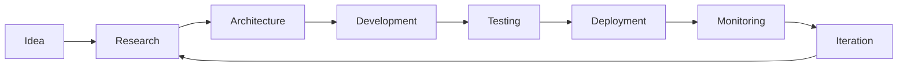
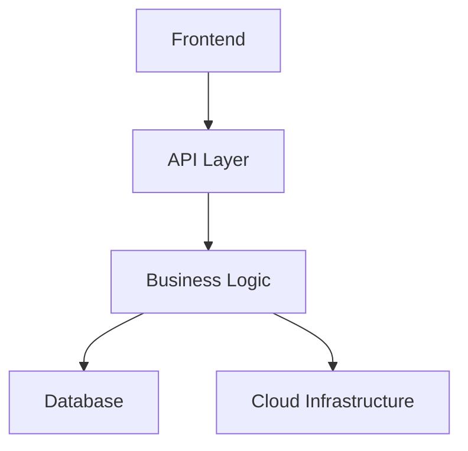

 

Building production-grade AI systems, distributed platforms, and modern software.

  

We build software the way it's meant to be built — designed deliberately, engineered for production, and documented so anyone can pick it up.

 

 

---

 

## About

**CAForge** is a small engineering organization designing modern software with production-quality engineering practices. Every project is treated as a real system, not a demo — built with the same discipline around architecture, reliability, and documentation regardless of scale.

Our focus areas:

<table>
<tr>
<td>

**Artificial Intelligence**
Applied ML and real-time computer vision

</td>
<td>

**Backend Engineering**
API and service design

</td>
<td>

**Distributed Systems**
Event streaming and multi-service architecture

</td>
</tr>
<tr>
<td>

**Cloud Infrastructure**
Containerized, cloud-deployed systems

</td>
<td>

**Developer Experience**
Documentation and tooling that reduce friction

</td>
<td>

**Full-Stack Engineering**
End-to-end products, data to interface

</td>
</tr>
</table>

 

---

 

## Engineering Philosophy

<table>
<tr><td width="50%">

**Build for production**
Code is written to hold up under real conditions, not just to demo well.

</td><td width="50%">

**Design before implementation**
Architecture decisions are made deliberately, before the first line of code.

</td></tr>
<tr><td width="50%">

**Performance by default**
Latency and resource usage are measured, not assumed.

</td><td width="50%">

**Readable software**
Code is written for the next engineer reading it, not just the compiler.

</td></tr>
<tr><td width="50%">

**Scalable architecture**
Clear service boundaries so components can evolve independently.

</td><td width="50%">

**Reliable infrastructure**
Systems are containerized and deployed the same way every time.

</td></tr>
<tr><td width="50%">

**Automation over repetition**
Linting, testing, and builds run in CI — not by hand, before every push.

</td><td width="50%">

**Documentation as code**
READMEs and architecture docs are maintained alongside the code they describe.

</td></tr>
</table>

 

---

 

## Technology Stack

**Languages**

**Backend**

**Frontend**

**AI**

**Cloud**

 

---

 

## Featured Projects

 

**[FleetFlow](https://github.com/CAForge/FleetFlow)** · [Live](http://13.53.163.137/)
Real-time telemetry platform simulating connected vehicles over an event-driven streaming architecture.
- Kafka-based ingestion decoupling simulation from processing
- Redis caching layer with PostgreSQL for persistence
- Multi-service design: simulator, processing, and API layers
- Containerized and deployed on AWS EC2

`FastAPI` `Kafka` `Redis` `PostgreSQL` `Docker` `AWS`

 

**[Neuro-Drive](https://github.com/CAForge/neuro-driver)** · [Demo](https://youtu.be/NpORRi-yiKY)
Real-time AI driver monitoring platform for fatigue and distraction detection.
- MediaPipe Face Mesh with EAR/MAR based fatigue analysis
- Gaze tracking and head-pose deviation estimation
- Per-user calibration for cross-condition robustness
- Live alerting via Server-Sent Events

`Python` `OpenCV` `MediaPipe` `FastAPI` `SSE`

 

**[Echo-Vision](https://github.com/CAForge/Echo-Vision)** · [Live](https://echo-vision-seven.vercel.app/)
Browser-based assistive vision platform for accessibility.
- On-device object detection across 80+ classes
- Directional and distance-aware spatial guidance
- Gemini-powered scene narration with voice output

`React` `TypeScript` `TensorFlow.js` `Face-API.js` `Gemini API`

 

**[Shadow-Sim](https://github.com/CAForge/shadow-sim)** · [Live](https://shadow-sim.vercel.app/)
Vehicle digital twin with real-time telemetry synchronization.
- Kinematic bicycle model physics engine
- WebSocket telemetry at 20Hz with dead-reckoning prediction
- Statistical outlier filtering for data integrity

`FastAPI` `WebSockets` `Three.js`

 

**[HR-Dashboard](https://github.com/CAForge/HR_DASHBOARD)** · [Live](https://hr-dashboard-five-dusky.vercel.app/)
Modern HR management platform with AI-assisted workflows.
- Employee and project tracking
- Modular, service-based frontend architecture
- Gemini API integration for AI-assisted features

`React` `TypeScript` `Vite` `Node.js`

 

---

 

## Software Architecture

**Engineering workflow**

**System layout**

 

---

 

## Development Standards

Every repository in this organization follows the same baseline:

- Containerization for consistent local and production environments
- Clear, maintained documentation
- Conventional Commits for a readable history
- CI/CD on every pull request
- Mandatory code review before merge
- Test coverage for core logic
- Clean, layered architecture
- Semantic versioning for releases
- API documentation where applicable
- Issue tracking for planned work
- A meaningful README — not a placeholder

 

---

 

## Team

<table>
<tr>
<td width="50%">

**Chitransh Sahrawat**
AI Engineering · Computer Vision · Backend · Distributed Systems
[github.com/chitranshsahrawat](https://github.com/chitranshsahrawat)

</td>
<td width="50%">

**Aditya Tiwari**
Full-Stack Engineering · Frontend · Backend · System Design
[github.com/Adityatiwari86](https://github.com/Adityatiwari86)

</td>
</tr>
</table>

 

---

 

## Current Focus

`Distributed Systems` `AI Infrastructure` `Cloud-Native Applications` `Developer Tools` `Computer Vision` `Production-Grade APIs`

 

---

 

## Future Direction

CAForge is building toward a growing set of scalable, production-grade systems — spanning distributed infrastructure, real-time applications, and applied AI. Each new project is an opportunity to raise the engineering bar set by the last one, with the long-term goal of open-sourcing work that reflects genuine software craftsmanship rather than one-off builds.

 

---

 

**CAForge**
Engineering software with clarity, scalability, and purpose.

