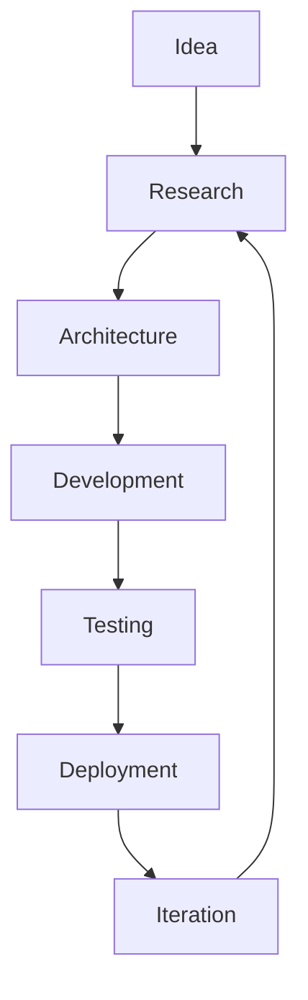

 

**Building production-grade AI systems, distributed platforms, and full-stack software.**

 

 

---

## About CAForge

**CAForge** is a small, focused engineering organization building real-time and AI-driven software across several domains:

- **AI Engineering** — computer vision, real-time inference, applied ML pipelines
- **Backend Engineering** — API design, service architecture, data pipelines
- **Distributed Systems** — event streaming, caching layers, multi-service orchestration
- **Cloud Infrastructure** — containerization, deployment automation, cloud hosting
- **Full-Stack Applications** — end-to-end products from data pipeline to UI
- **Developer Tooling** — internal standards, CI/CD, and reusable engineering practices

Every project under CAForge is built and maintained by the same two engineers, following a shared set of engineering standards described below — the goal is consistency and quality across every repository, not just isolated one-off projects.

 

---

## Engineering Principles

<table>
<tr>
<td width="33%" valign="top">

### 🏗️ Production First
Code is written to run, not just to demo. Error handling, edge cases, and real-world conditions are treated as first-class concerns.

</td>
<td width="33%" valign="top">

### ⚡ Performance Matters
Latency, memory, and throughput are measured, not assumed — especially in real-time and streaming systems.

</td>
<td width="33%" valign="top">

### 🧭 Developer Experience
Clear READMEs, sane defaults, and one-command setups. If it takes more than a few steps to run locally, it's a bug.

</td>
</tr>
<tr>
<td width="33%" valign="top">

### 🧱 Scalable Architecture
Systems are designed with clear service boundaries, so components can scale or be replaced independently.

</td>
<td width="33%" valign="top">

### 📖 Readable Code
Code is written for the next person reading it — including the two of us, six months later.

</td>
<td width="33%" valign="top">

### 🤝 Open Collaboration
All work moves through issues and reviewed pull requests, never direct commits to `main`.

</td>
</tr>
<tr>
<td width="33%" valign="top">

## Tech Stack

**Languages**

**Backend**

**Frontend**

**Cloud & Infra**

**AI / Computer Vision**

 

---

## Featured Projects

<table>
<tr>
<td width="50%" valign="top">

### 🚚 [FleetFlow](https://github.com/CAForge/FleetFlow)

Real-time telemetry platform simulating 120 connected vehicles, built on an event-driven streaming architecture.

- Apache Kafka for asynchronous telemetry ingestion
- Redis caching + PostgreSQL for persistence
- Multi-service architecture (Simulator / Processing / API)
- Dockerized, deployed on AWS EC2

`FastAPI` `Kafka` `Redis` `PostgreSQL` `Docker` `AWS`

</td>
<td width="50%" valign="top">

### 🚗 [Neuro-Drive](https://github.com/CAForge/neuro-driver)

Real-time AI driver monitoring system for fatigue and distraction detection.

- MediaPipe Face Mesh (468 landmarks + iris tracking)
- EAR / MAR based drowsiness & yawning detection
- Gaze and head-pose deviation tracking
- Live alerts via Server-Sent Events

`Python` `OpenCV` `MediaPipe` `FastAPI` `SSE`

</td>
</tr>
<tr>
<td width="50%" valign="top">

### 👁️ [Echo-Vision](https://github.com/CAForge/Echo-Vision)

Browser-based assistive vision platform for accessibility.

- Real-time on-device object detection (80+ classes)
- Directional + distance-based spatial guidance
- Gemini-powered scene narration
- Native browser speech synthesis for voice feedback

`React` `TypeScript` `TensorFlow.js` `Face-API.js` `Gemini API`

</td>
<td width="50%" valign="top">

### 🕹️ [Shadow-Sim](https://github.com/CAForge/shadow-sim)

Real-time vehicle digital twin and interactive simulation platform.

- Kinematic bicycle model physics engine
- WebSocket telemetry at 20Hz with dead-reckoning prediction
- Z-score based outlier filtering for data integrity
- Replay recording and scrubbing

`FastAPI` `WebSockets` `Three.js`

</td>
</tr>
<tr>
<td width="50%" valign="top">

### 🧑‍💼 [HR-Dashboard](https://github.com/CAForge/HR_DASHBOARD)

Modern HR management platform.

- Employee tracking and project allocation
- AI-assisted features via Gemini API
- Modular, service-based frontend architecture

`React` `TypeScript` `Vite` `Node.js`

</td>
<td width="50%" valign="top">

 

*More projects in progress — check [all repositories](https://github.com/orgs/CAForge/repositories).*

</td>
</tr>
</table>

 

---

## Team

<table>
<tr>
<td align="center" width="50%">

### Chitransh Sahrawat
**AI Engineering · Backend · Distributed Systems · Computer Vision**

</td>
<td align="center" width="50%">

### Aditya Tiwari
**Full-Stack · System Design · Frontend Engineering · Backend**

</td>
</tr>
</table>

 

---

## Engineering Workflow

Every project moves through this cycle — architecture and testing are not skipped steps, they're where most of the actual engineering decisions happen.

 

---

## Repository Standards

Every repository in this organization is expected to include:

- [x] Dockerized setup for local development
- [x] Clear, complete documentation (README with setup + architecture)
- [x] Documented architecture (diagrams where relevant)
- [x] CI pipeline (lint + test on every PR)
- [x] Test coverage for core logic
- [x] License file (MIT by default)
- [x] Conventional Commits for commit history
- [x] GitHub Actions for automation

<b>Why these standards?</b>

 
Consistency across repositories means anyone — including future collaborators — can open any CAForge project and immediately understand how to run it, how it's structured, and how to contribute to it, without needing a walkthrough.

 

---

## Current Focus

`Distributed Systems` `Real-Time Applications` `Computer Vision` `Applied AI` `Developer Tools` `Cloud-Native Software`

 

---

## Future Vision

CAForge exists to build software that holds up under real-world conditions — not just demo conditions. The long-term goal is to keep expanding across distributed systems, real-time applications, and applied AI, while treating every repository as an opportunity to practice better architecture, better testing, and better documentation than the last one. Software craftsmanship isn't a one-time achievement — it's a discipline that compounds project over project, and that's the standard this organization is built around.

 

---

**Made by CAForge**

