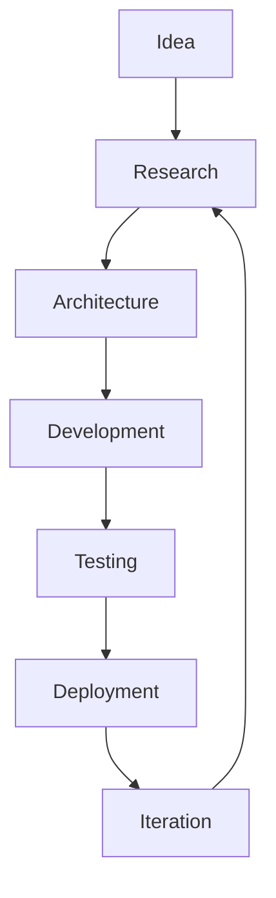

<div align="center">


<br/>

**Two engineering students building real, working software — one project at a time.**

<br/>

[](https://github.com/orgs/CAForge/repositories)
[](#team)
[](#featured-projects)

</div>

<br/>

---

## About CAForge

**CAForge** is a small student-run engineering group. We build projects across a few areas we're actively learning and interested in:

- **AI & Computer Vision** — applied ML, real-time inference experiments
- **Backend Engineering** — API design, service architecture, data pipelines
- **Distributed Systems** — event streaming, caching, multi-service setups
- **Cloud & Infra** — containerization, CI/CD, deployment
- **Full-Stack Apps** — end-to-end projects from data layer to UI

Every project here is built and maintained by the two of us. We don't claim production scale or real-world users — these are learning projects built to a high bar, not commercial products. What we do try to hold ourselves to is writing code that actually runs, documenting it properly, and following the same practices you'd expect in a real engineering team.

<br/>

---

## What We Actually Care About

<table>
<tr>
<td width="33%" valign="top">

### 🏗️ Working Code
We build things that run end-to-end, not just demos that work once on our machine. Error handling and edge cases aren't an afterthought.

</td>
<td width="33%" valign="top">

### ⚡ Measuring, Not Guessing
Where performance matters (streaming, real-time), we actually benchmark instead of assuming something is "fast enough."

</td>
<td width="33%" valign="top">

### 🧭 Easy to Run
Clear READMEs and simple setup. If a project needs more than a couple of steps to get running locally, we treat that as a bug.

</td>
</tr>
<tr>
<td width="33%" valign="top">

### 🧱 Sane Architecture
We try to design clear boundaries between components so pieces can be swapped or scaled independently — even in small projects.

</td>
<td width="33%" valign="top">

### 📖 Readable Code
Written so the other person on the team (or either of us, months later) can actually understand it without a walkthrough.

</td>
<td width="33%" valign="top">

### 🤝 Real Workflow
Issues and pull requests, not direct commits to `main` — because that's the habit we're trying to build.

</td>
</tr>
<tr>
<td width="33%" valign="top">

### ✅ Testing Core Logic
We test the important logic before calling something done, not after it breaks.

</td>
<td width="33%" valign="top">

### 🤖 Automating the Boring Stuff
Linting, testing, and builds run through CI instead of being done manually before every push.

</td>
<td width="33%" valign="top">

### 📦 CI/CD
Pull requests are checked automatically, and stable points get tagged as releases.

</td>
</tr>
</table>

<br/>

---

## Tech Stack

<div align="center">

**Languages**


**Backend**


**Frontend**


**Cloud & Infra**


**AI / Computer Vision**


</div>

<br/>

---

## Featured Projects

<br/>

<div align="center">

### 🚚 FleetFlow
**Production-inspired telemetry platform simulating connected vehicles through distributed event streaming.**

`FastAPI` • `Kafka` • `Redis` • `Docker` • `PostgreSQL` • `AWS`

<p>
<a href="https://github.com/CAForge/FleetFlow">

</a>
<a href="http://13.53.163.137">

</a>
</p>

</div>

<br/>

```
━━━━━━━━━━━━━━━━━━━━━━━━━━━━━━━━━━━━━━━━━━━━━━━━━━━━━━━━━━━━━━━━━━━━━━━━━━━
```

<br/>

<div align="center">

### 🧠 Neuro-Drive
**Real-time driver monitoring system using computer vision for fatigue, distraction and gaze estimation.**

`Python` • `OpenCV` • `MediaPipe` • `FastAPI`

<p>
<a href="https://github.com/CAForge/neuro-driver">

</a>
<a href="https://youtu.be/NpORRi-yiKY?si=Dnqln9wsIOw4MMO">

</a>
</p>

</div>

<br/>

```
━━━━━━━━━━━━━━━━━━━━━━━━━━━━━━━━━━━━━━━━━━━━━━━━━━━━━━━━━━━━━━━━━━━━━━━━━━━
```

<br/>

<div align="center">

### 👁 Echo Vision
**Browser-based assistive vision platform providing object detection and AI-powered scene understanding.**

`React` • `TensorFlow.js` • `Gemini API`

<p>
<a href="https://github.com/CAForge/Echo-Vision">

</a>
<a href="https://echo-vision-seven.vercel.app/">

</a>
</p>

</div>

<br/>

```
━━━━━━━━━━━━━━━━━━━━━━━━━━━━━━━━━━━━━━━━━━━━━━━━━━━━━━━━━━━━━━━━━━━━━━━━━━━
```

<br/>

<div align="center">

### 🚘 Shadow Sim
**Digital twin platform synchronizing vehicle telemetry in real time.**

`React` • `FastAPI` • `WebSockets`

<p>
<a href="https://github.com/CAForge/shadow-sim">

</a>
<a href="https://shadow-sim.vercel.app/">

</a>
</p>

</div>

<br/>

```
━━━━━━━━━━━━━━━━━━━━━━━━━━━━━━━━━━━━━━━━━━━━━━━━━━━━━━━━━━━━━━━━━━━━━━━━━━━
```

<br/>

<div align="center">

### 📊 HR Dashboard
**Modern HR management platform featuring employee workflows, analytics and AI-assisted capabilities.**

`React` • `TypeScript` • `Node.js`

<p>
<a href="https://github.com/CAForge/HR_DASHBOARD">

</a>
<a href="https://hr-dashboard-five-dusky.vercel.app/">

</a>
</p>

</div>

<br/>

<div align="center">

*More projects in progress — check [all repositories](https://github.com/orgs/CAForge/repositories).*

</div>

<br/>

---

## Team

<table>
<tr>
<td align="center" width="50%">


### Chitransh Sahrawat
**AI · Backend · Distributed Systems · Computer Vision**

[](https://github.com/chitranshsahrawat)

</td>
<td align="center" width="50%">


### Aditya Tiwari
**Full-Stack · System Design · Frontend · Backend**

[](https://github.com/Adityatiwari86)

</td>
</tr>
</table>

<br/>

---

## How We Work



We try to actually go through this loop instead of skipping straight from idea to code — that's where most of the learning happens.

<br/>

---

## Repository Standards

We aim for every repo in this org to have:

- [x] Dockerized local setup
- [x] A clear README (setup + architecture)
- [x] Documented architecture, with diagrams where it helps
- [x] CI pipeline (lint + test on every PR)
- [x] Tests for the core logic
- [x] License file (MIT by default)
- [x] Conventional Commits
- [x] GitHub Actions for automation

<details>
<summary><b>Why bother with this as students?</b></summary>
<br/>
Because these are the habits that actually matter once you're working on a real team — and it's a lot easier to build them now, on small projects, than to pick them up later under pressure.
</details>

<br/>

---

## Current Focus

<div align="center">

`Distributed Systems` `Real-Time Applications` `Computer Vision` `Applied AI` `Developer Tools`

</div>

<br/>

---

## Where This Is Going

CAForge is our space to get better at building software that actually works, not just software that demos well. We're both still students, so this is very much a work in progress — the plan is to keep shipping projects across distributed systems, real-time apps, and applied AI, and to hold each new one to a slightly higher bar than the last.

<br/>

---

<div align="center">

**Made by CAForge**

</div>
