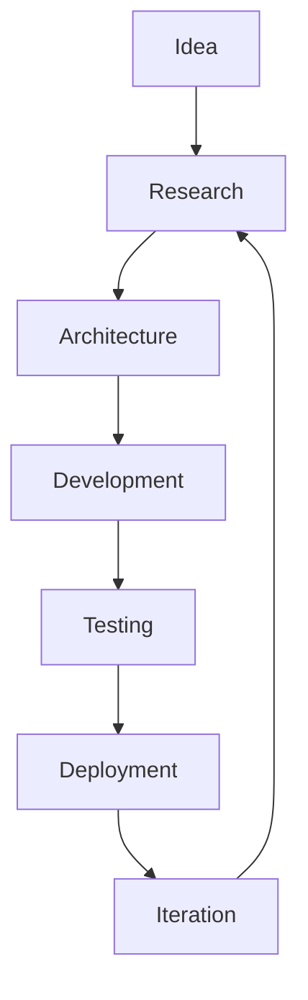

<div align="center">


<br/>

**Two Computer Science students building real, working software — one project at a time.**

<br/>

[](https://github.com/orgs/CAForge/repositories)
[](#team)
[](#featured-projects)

</div>

---

## About

**CAForge** is a small, two-person student engineering group. We use it as a workspace to turn ideas into working software while actually learning how modern systems are built — event-driven architecture, cloud deployment, computer vision, distributed systems, and full-stack development.

We don't claim production scale, real user bases, or commercial polish. These are **learning projects built to a high bar** — the goal is code that genuinely runs end-to-end, is documented properly, and follows the same practices a real engineering team would use, not college assignments dressed up.

<br/>

## What We Actually Care About

<table>
<tr>
<td width="33%" valign="top">

### 🏗️ Working Code
We build things that run end-to-end, not demos that only work once on our own machine. Error handling isn't an afterthought.

</td>
<td width="33%" valign="top">

### ⚡ Measuring, Not Guessing
Where performance matters (streaming, real-time), we benchmark instead of assuming something is "fast enough."

</td>
<td width="33%" valign="top">

### 🧭 Easy to Run
Clear READMEs, simple setup. If getting a project running locally takes more than a couple of steps, that's a bug.

</td>
</tr>
<tr>
<td width="33%" valign="top">

### 🧱 Sane Architecture
Clear boundaries between components, even in small projects, so pieces can be swapped or scaled independently.

</td>
<td width="33%" valign="top">

### 📖 Readable Code
Written so the other person on the team — or either of us months later — can understand it without a walkthrough.

</td>
<td width="33%" valign="top">

### 🤝 Real Workflow
Issues and pull requests instead of direct commits to `main`, because that's the habit we're trying to build.

</td>
</tr>
</table>

<br/>

---

## Tech Stack

<div align="center">


<br/><br/>


</div>

<br/>

---

## Featured Projects

<br/>

<div align="center">

### 🚚 FleetFlow
**Real-Time Telemetry Dashboard**

`FastAPI` • `Kafka` • `Redis` • `Docker` • `PostgreSQL` • `AWS EC2`

<p align="left">

- Architected a distributed telemetry platform that simulates 120 connected vehicles publishing live telemetry every 500 ms, leveraging Apache Kafka for asynchronous event streaming and PostgreSQL for persistent storage.
- Designed a multi-service backend comprising Simulator, Processing, and API services, implementing schema validation, Redis caching, GPS privacy filtering, and anomaly detection to enable reliable real-time fleet monitoring.
- Containerised the complete application using Docker Compose and deployed it on AWS EC2, delivering a reproducible development environment with a browser-based live telemetry dashboard.

</p>

<p>
<a href="https://github.com/CAForge/FleetFlow"></a>
<a href="http://13.53.163.137"></a>
</p>

</div>

<br/>

```
━━━━━━━━━━━━━━━━━━━━━━━━━━━━━━━━━━━━━━━━━━━━━━━━━━━━━━━━━━━━━━━━━━━━━━━━━━━
```

<br/>

<div align="center">

### 🧠 Neuro-Drive
**Driver Safety Detection System**

`Python` • `OpenCV` • `MediaPipe` • `FastAPI` • `SSE`

<p align="left">

- Developed a real-time AI driver monitoring system that combines MediaPipe Face Mesh (468 facial landmarks + iris tracking) with OpenCV to detect drowsiness, distraction, yawning, and head-pose deviations using a multi-factor fatigue analysis pipeline.
- Engineered a fatigue detection engine by integrating Eye Aspect Ratio (EAR), Mouth Aspect Ratio (MAR), gaze tracking, and head-pose estimation, supported by per-user calibration and adaptive low-light preprocessing to improve robustness across varying driving conditions.
- Built a FastAPI backend with REST APIs, Server-Sent Events (SSE), CSV event logging, and Docker-based deployment, enabling real-time browser alerts and post-session fatigue analysis.

</p>

<p>
<a href="https://github.com/CAForge/neuro-driver"></a>
<a href="https://youtu.be/NpORRi-yiKY?si=Dnqln9wsIOw4MMO"></a>
</p>

</div>

<br/>

```
━━━━━━━━━━━━━━━━━━━━━━━━━━━━━━━━━━━━━━━━━━━━━━━━━━━━━━━━━━━━━━━━━━━━━━━━━━━
```

<br/>

<div align="center">

### 👁 Echo Vision
**AI Vision Web App**

`React` • `TypeScript` • `TensorFlow.js` • `Face-API.js` • `MediaPipe` • `Gemini API`

<p align="left">

- Developed a browser-based assistive vision platform that performs real-time on-device object detection across 80+ object classes, integrating TensorFlow.js, Face-API.js, and MediaPipe to deliver object recognition, face recognition, gesture interaction, and contextual environmental awareness.
- Engineered a spatial guidance system using 3 directional zones (Left, Center, Right) and 3 distance categories (Near, Mid, Far), while integrating Google Gemini for scene narration, voice feedback, ambient light detection, and obstacle-aware navigation.
- Optimised the application for responsive cross-device usage by modularising the React architecture, implementing reusable UI components, and integrating browser-native speech synthesis to deliver low-latency voice assistance across multiple AI features.

</p>

<p>
<a href="https://github.com/CAForge/Echo-Vision"></a>
<a href="https://echo-vision-seven.vercel.app/"></a>
</p>

</div>

<br/>

```
━━━━━━━━━━━━━━━━━━━━━━━━━━━━━━━━━━━━━━━━━━━━━━━━━━━━━━━━━━━━━━━━━━━━━━━━━━━
```

<br/>

<div align="center">

### 🚘 Shadow Sim
**Digital twin platform synchronizing vehicle telemetry in real time.**

`React` • `FastAPI` • `WebSockets`

<p>
<a href="https://github.com/CAForge/shadow-sim"></a>
<a href="https://shadow-sim.vercel.app/"></a>
</p>

</div>

<br/>

```
━━━━━━━━━━━━━━━━━━━━━━━━━━━━━━━━━━━━━━━━━━━━━━━━━━━━━━━━━━━━━━━━━━━━━━━━━━━
```

<br/>

<div align="center">

### 📊 HR Dashboard
**HR management platform featuring employee workflows, analytics and AI-assisted capabilities.**

`React` • `TypeScript` • `Node.js`

<p>
<a href="https://github.com/CAForge/HR_DASHBOARD"></a>
<a href="https://hr-dashboard-five-dusky.vercel.app/"></a>
</p>

</div>

<br/>

<div align="center">

*More projects in progress — check [all repositories](https://github.com/orgs/CAForge/repositories).*

</div>

<br/>

---

## Team

<table>
<tr>
<td align="center" width="50%">


### Chitransh Sahrawat
**AI · Backend · Distributed Systems · Computer Vision**

[](https://github.com/chitranshsahrawat)

</td>
<td align="center" width="50%">


### Aditya Tiwari
**Full-Stack · System Design · Frontend · Backend**

[](https://github.com/Adityatiwari86)

</td>
</tr>
</table>

<br/>

---

## How We Work



We try to actually go through this loop instead of jumping straight from idea to code — that's where most of the learning happens.

<br/>

---

## Repository Standards

Every repo in this org aims for:

- [x] Dockerized local setup
- [x] A clear README (setup + architecture)
- [x] Documented architecture, with diagrams where it helps
- [x] CI pipeline (lint + test on every PR)
- [x] Tests for the core logic
- [x] License file (MIT by default)
- [x] Conventional Commits
- [x] GitHub Actions for automation

<details>
<summary><b>Why bother with this as students?</b></summary>
<br/>
Because these are the habits that actually matter once you're on a real engineering team — and it's a lot easier to build them now, on small projects, than to pick them up later under pressure.
</details>

<br/>

---

## Current Focus

<div align="center">

`Distributed Systems` `Real-Time Applications` `Computer Vision` `Applied AI` `Developer Tools`

</div>

<br/>

---

## Where This Is Going

CAForge is our space to get better at building software that actually works, not just software that demos well. We're both still students, so this is very much a work in progress — the plan is to keep shipping across distributed systems, real-time apps, and applied AI, and hold each new project to a slightly higher bar than the last.

<br/>

---

<div align="center">

**Made by CAForge**

*Building software with curiosity, collaboration, and craftsmanship.*


</div>
